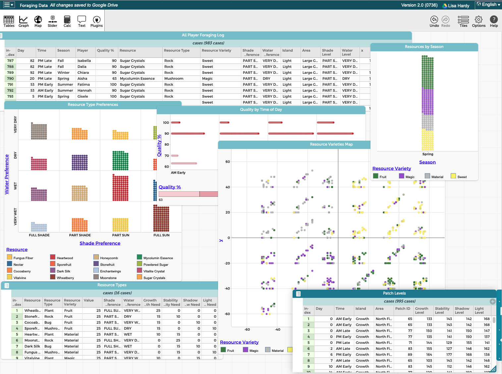
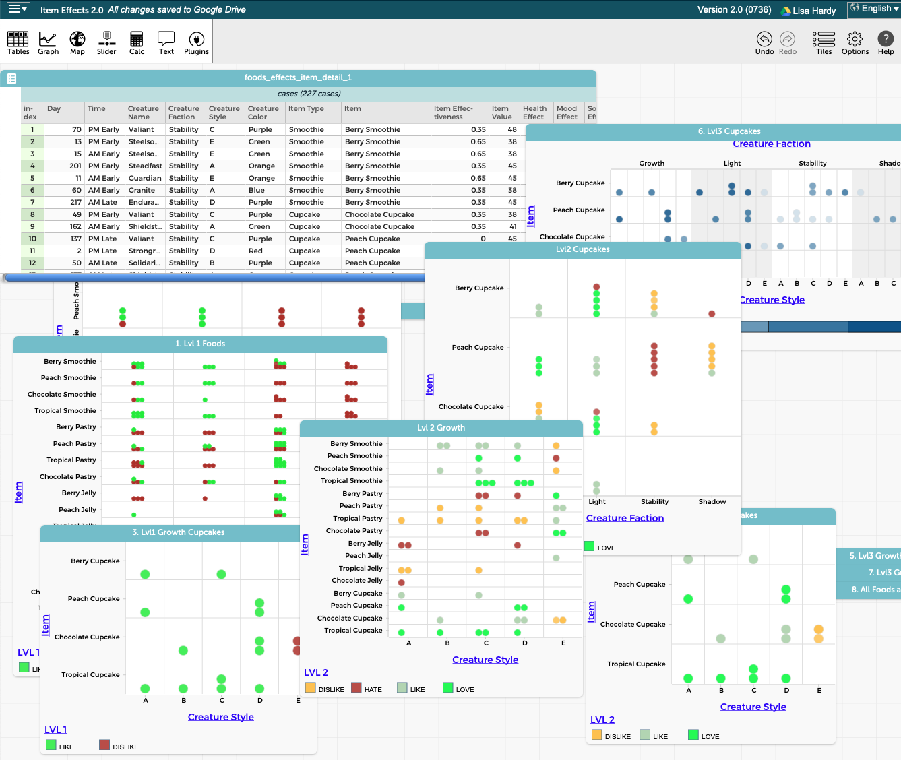
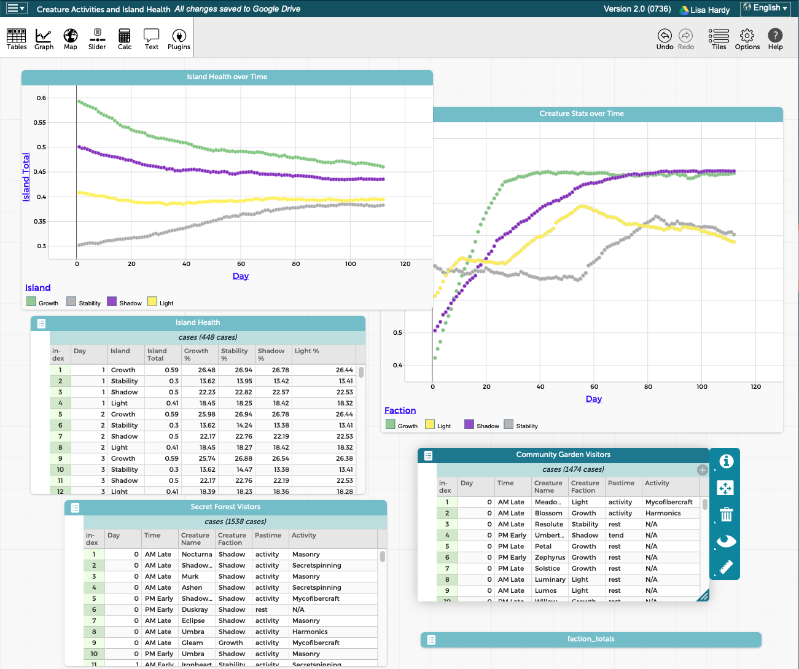

# Ilkmaar CODAP Datasets

A collection of interconnected game world datasets designed for teaching data science concepts. These datasets are formatted for [CODAP (Common Online Data Analysis Platform)](https://codap.concord.org/), a free web-based data analysis tool.

## Datasets Overview

This repository contains four interconnected datasets from the Ilkmaar game world:

1. **Foraging Data** - Information about player foraging activities, resources collected, and environmental factors.
2. **Item Effects 2.0** - Details on how various food items affect creature stats and behavior.
3. **Gift Effects** - Information about gift giving mechanics and their effects on creatures.
4. **Creature Activities and Island Health** - Data tracking creature activities and their impact on island health metrics.

For detailed information about the game systems and mechanics that produce this data, see the [Ilkmaar Design Documentation](https://github.com/ilkmaar/design-docs).

## Dataset Visualizations

### Foraging Data
This dataset tracks player foraging activities, resource types, environmental conditions, and quality metrics.

### Item Effects
This dataset shows the relationships between food items, creature attributes, and the resulting effects on creature behavior and stats.

### Island Health and Creature Activities
This dataset tracks creature activities and their impact on island metrics over time, including growth, stability, shadow, and light values.

## Usage

These datasets are designed to be:
- Explorable through the CODAP interface
- Interconnected to enable complex data analysis
- Useful for teaching data science concepts through game data

To use these datasets:
1. Open [CODAP](https://codap.concord.org/)
2. Import the desired .codap file
3. Explore the data through tables, graphs, and other visualizations

## License

See the [LICENSE](LICENSE) file for details.